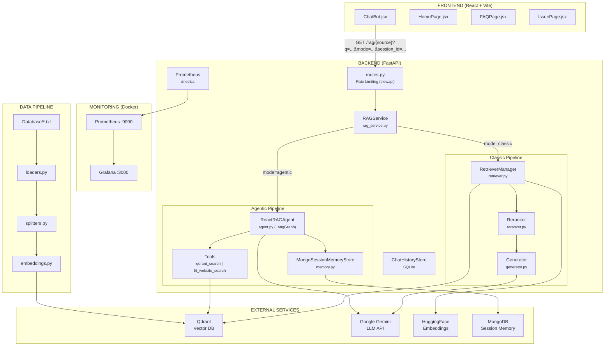
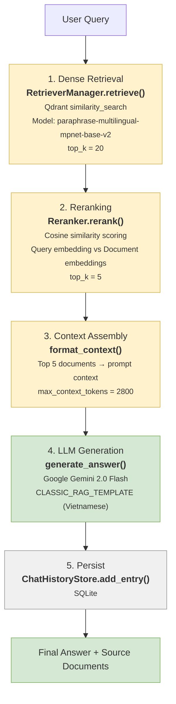
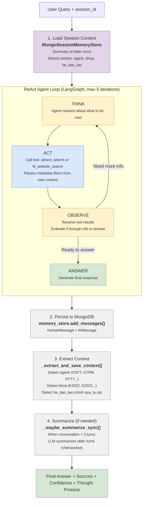
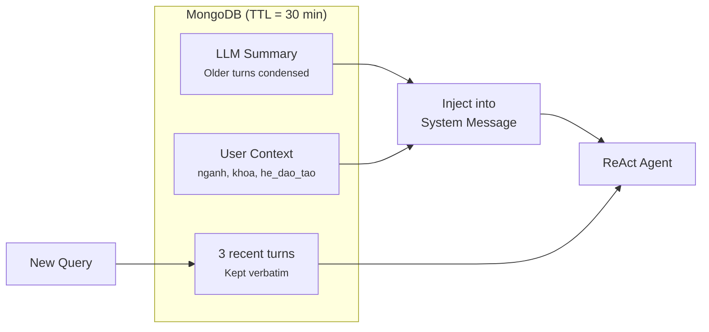
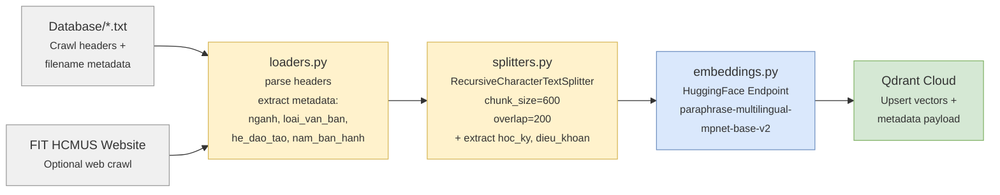
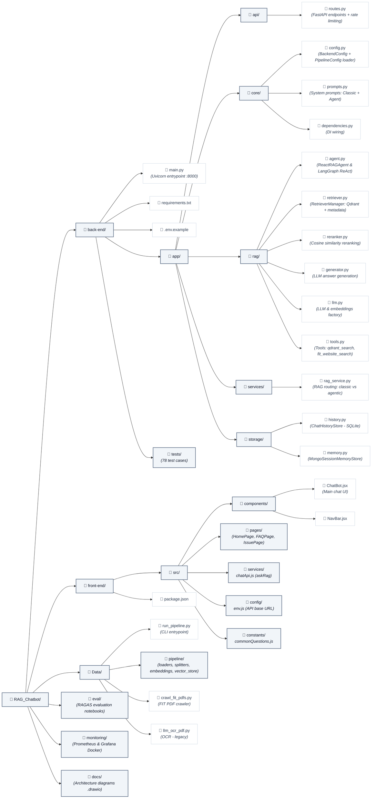

# RAG Chatbot - FIT HCMUS


Chatbot tu van hoc vu cho sinh vien Khoa Cong Nghe Thong Tin (FIT), truong Dai hoc Khoa Hoc Tu Nhien - DHQG TP.HCM. Su dung kien truc RAG (Retrieval-Augmented Generation) voi ReAct Agent, Memory, va Vector Database.

## System Design



## RAG Workflow

### Classic Mode (`mode=classic`)



### Agentic Mode (`mode=agentic`) — ReAct Agent



### Memory Strategy (Buffer + Summary Hybrid)



### Data Pipeline



## Tech Stack

| Layer | Technology | Version/Notes |
|-------|-----------|---------------|
| Frontend | React 18 + Vite | TailwindCSS, DaisyUI |
| Backend | FastAPI | 0.115.6 |
| LLM | Google Gemini 2.0 Flash | via `langchain-google-genai` |
| Agent | LangGraph | `create_react_agent` (ReAct) |
| Orchestration | LangChain | 1.x (core, community, qdrant) |
| Vector DB | Qdrant | client 1.11.2 |
| Embeddings | HuggingFace | `paraphrase-multilingual-mpnet-base-v2` |
| Session Memory | MongoDB | pymongo 4.6+ (TTL auto-expire) |
| Chat History | SQLite | local file `chat_history.db` |
| Rate Limiting | slowapi | IP-based, configurable per endpoint |
| Monitoring | Prometheus + Grafana | via Docker |
| Data Pipeline | PyMuPDF, PaddleOCR, trafilatura | PDF/web extraction |

## Project Structure



## API Endpoints

| Method | Path | Rate Limit | Description |
|--------|------|-----------|-------------|
| GET | `/` | 30/min | Health check |
| GET | `/rag/{source}` | 10/min | RAG query (source: `qdrant`, `fit_web`, `auto`) |
| GET | `/history` | 30/min | Chat history (limit=50) |
| GET | `/history/{id}` | 30/min | Specific history entry |
| GET | `/sessions` | 30/min | Active memory sessions |
| DELETE | `/sessions/{id}` | 30/min | Clear session memory |
| GET | `/metrics` | — | Prometheus metrics |

**Query Parameters** for `/rag/{source}`:

- `q` (required) — Query text
- `mode` — `classic` or `agentic` (default: classic)
- `session_id` — Session ID for memory continuity (agentic mode)
- `debug` — Include thought_process in response

---

## Cai dat

### Backend
```bash
cd back-end
cp .env.example .env     # Dien GOOGLE_API_KEY, QDRANT_URL, QDRANT_API_KEY
pip install -r requirements.txt
python main.py           # http://127.0.0.1:8000
```

### Frontend
```bash
cd front-end
cp .env.example .env     # Dien VITE_API_BASE_URL
npm install
npm run dev              # http://localhost:5173
```

### Data Pipeline
```bash
cd Data
cp .env.example .env     # Dien QDRANT_URL, QDRANT_API_KEY, HUGGINGFACE_API_KEY
python run_pipeline.py   # Build vector index
```

### Monitoring
```bash
docker compose -f monitoring/docker-compose.monitoring.yml up -d
# Prometheus: http://localhost:9090
# Grafana: http://localhost:3000 (admin/admin)
```

### Tests
```bash
cd back-end
pip install pytest
python -m pytest tests/ -v    # 78 test cases
```

## Demo

[YouTube Demo](https://www.youtube.com/watch?v=EotYfkb3Oh4&feature=youtu.be)

---

## Contributing

1. Fork repo
2. Tao branch moi (`git checkout -b feature/ten-feature`)
3. Commit thay doi (`git commit -m "feat: mo ta thay doi"`)
4. Push branch (`git push origin feature/ten-feature`)
5. Tao Pull Request

Vui long dam bao chay tests truoc khi tao PR:
```bash
cd back-end && python -m pytest tests/ -v
```

## Tai lieu tham khao (References)

### Papers

| Paper | Tac gia | Mo ta |
|-------|---------|-------|
| [Retrieval-Augmented Generation for Knowledge-Intensive NLP Tasks](https://arxiv.org/abs/2005.11401) | Lewis et al., 2020 | Kien truc RAG goc — ket hop retrieval voi generation |
| [ReAct: Synergizing Reasoning and Acting in Language Models](https://arxiv.org/abs/2210.03629) | Yao et al., 2022 | ReAct Agent — vong lap Think-Act-Observe |
| [Sentence-BERT: Sentence Embeddings using Siamese BERT-Networks](https://arxiv.org/abs/1908.10084) | Reimers & Gurevych, 2019 | Sentence embeddings cho semantic search |

### Documentation

| Cong nghe | Tai lieu |
|-----------|---------|
| LangChain | [python.langchain.com/docs](https://python.langchain.com/docs/introduction/) |
| LangGraph | [langchain-ai.github.io/langgraph](https://langchain-ai.github.io/langgraph/) |
| FastAPI | [fastapi.tiangolo.com](https://fastapi.tiangolo.com/) |
| Qdrant | [qdrant.tech/documentation](https://qdrant.tech/documentation/) |
| Google Gemini API | [ai.google.dev/docs](https://ai.google.dev/docs) |
| Sentence-Transformers | [sbert.net](https://www.sbert.net/) |
| React | [react.dev](https://react.dev/) |
| Vite | [vite.dev/guide](https://vite.dev/guide/) |
| TailwindCSS | [tailwindcss.com/docs](https://tailwindcss.com/docs/) |
| DaisyUI | [daisyui.com](https://daisyui.com/) |
| Prometheus | [prometheus.io/docs](https://prometheus.io/docs/) |
| Grafana | [grafana.com/docs](https://grafana.com/docs/) |

## Acknowledgments

- **Khoa Cong nghe Thong tin (FIT)** — Truong Dai hoc Khoa Hoc Tu Nhien, DHQG TP.HCM
- Cac du lieu huan luyen duoc thu thap tu [fit.hcmus.edu.vn](https://www.fit.hcmus.edu.vn/)

## License

Du an nay duoc phat hanh theo [MIT License](LICENSE).

```
MIT License - Copyright (c) 2023 phatjk
```
